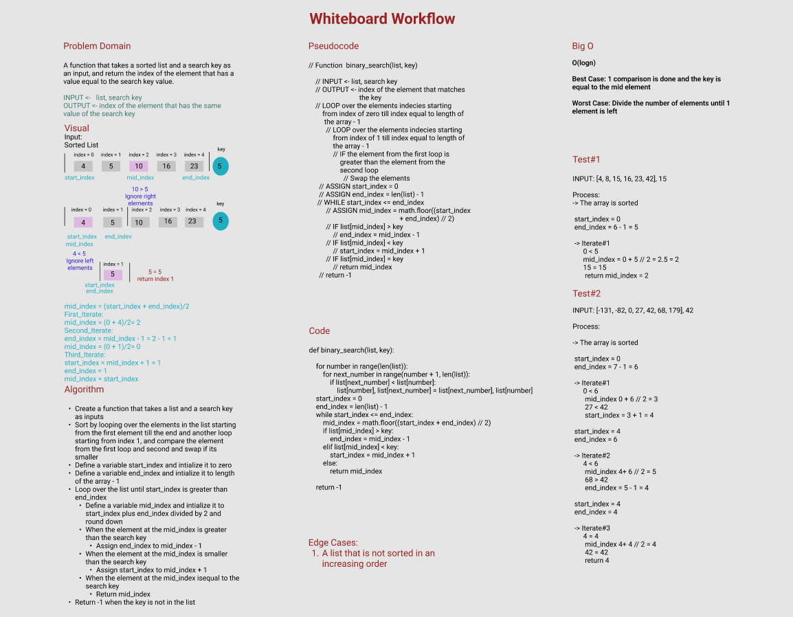

## Whiteborad Process

## Approach & Efficiency

**Approach:**
1. Create a function that takes a list and a search key as inputs
3. Sort by looping over the elements in the list starting from the first element till the end and another loop starting from index 1, and compare the element from the first loop and second and swap if its smaller
4. Define a variable start_index and intialize it to zero
5. Define a variable end_index and intialize it to length of the array - 1
6. Loop over the list until start_index is greater than end_index 
7. Define a variable mid_index and intialize it to start_index plus end_index divided by 2 and round down
8. When the element at the mid_index is greater than the search key
9. Assign end_index to mid_index - 1
10. When the element at the mid_index is smaller than the search key
11. Assign start_index to mid_index + 1
12. When the element at the mid_index isequal to the search key
13. Return mid_index
14. Return -1 when the key is not in the list

**Why this Approach:**

**Big O:**
O(logn)

Best Case: 1 comparison is done and the key is equal to the mid element

Worst Case: Divide the number of elements until 1 element is left
n/2 --> n/4 --> n/8 --> n/2^k