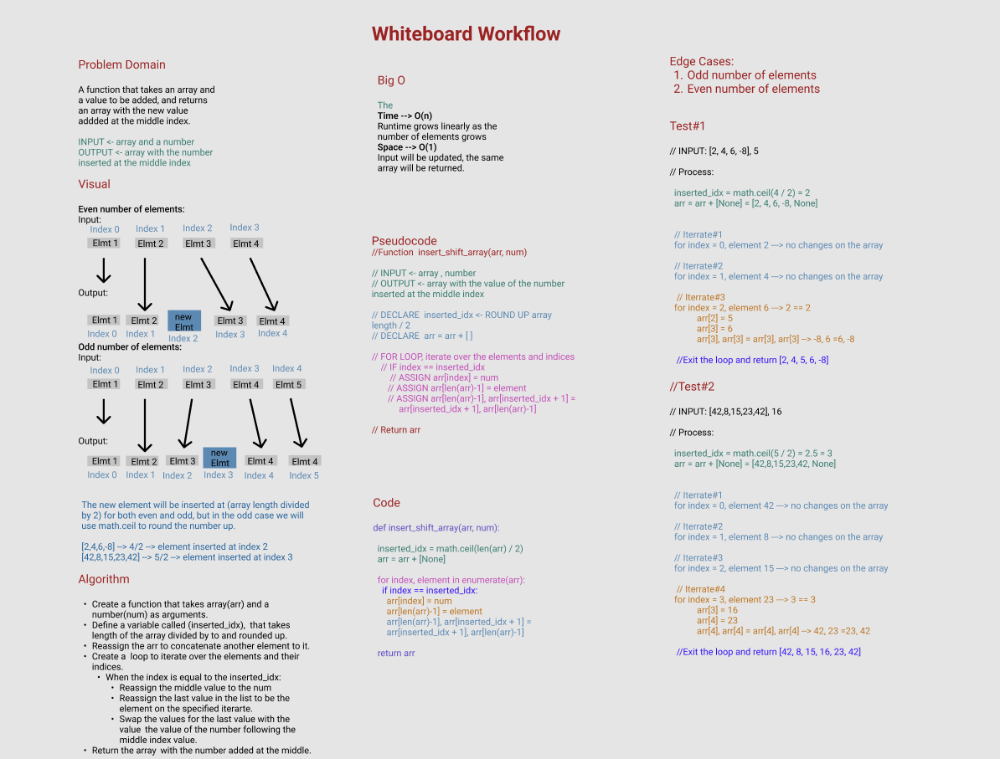

# Reverse an Array

A function that takes an array and a value to be added, and returns an array with the new value addded at the middle index.

## Whiteborad Process

## Approach & Efficiency

**Approach:**

I started by solving the problem using built in method, then I tried it without and with returning a new array, finally I reached to a solution theat returns the same array and without built-in methods.

1. Create a function that takes array(arr) and a number(num) as arguments.
2. Define a variable called (inserted_idx),  that takes length of the array divided by to and rounded up.
3. Reassign the arr to concatenate another element to it.
4. Create a  loop to iterate over the elements and their indices.
    -  When the index is equal to the inserted_idx:
        - Reassign the middle value to the num
        - Reassign the last value in the list to be the element on the specified iterarte.
        - Swap the values for the last value with the value following the middle index value.
5. Return the array with the number added at the middle.

**Why this Approach:**

**Big O:**

O(n): Which describes an algorithm whose performance will grow linearly and in direct proportion to the size of the input data set.

*Space*

O(1),
It will return the same array.
*Time*

O(n),
Runtime grows linearly as the number of elements in the list grows
