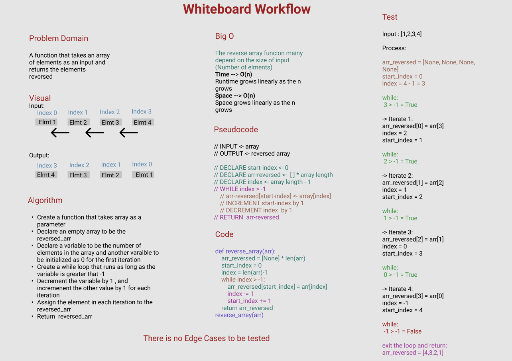

# Reverse an Array

A function that takes a list of elements as an input and returns a list of elements reversed.

## Whiteborad Process

## Approach & Efficiency

**Approach:**

1. Create a function that takes array as a parameter
2. Declare an empty array to be the reversed_arr
3. Declare a variable to be the number of elements in the array and another varaible to be initialized as 0 for the first iteration
4. Create a while loop that runs as long as the variable is greater than -1
5. Decrement the variable by 1 , and incremenent the other value by 1 for each iteration
6. Assign the element in each iteration to the reversed_arr
7. Return reversed_arr

**Why this Approach:**
.PNG)
**Big O:**

O(n): Which describes an algorithm whose performance will grow linearly and in direct proportion to the size of the input data set.

*Space*

O(n),
Space grows linearly as the n grows

*Time*

O(n),
Runtime grows linearly as the n grows

