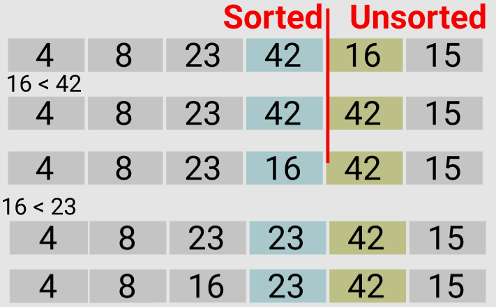

# Insertion Sort
- Insertion sort algorithm builds the sorted list one element at a time by comparing each item with the rest of the list and inserting it into its correct position.
- Insertion sort algorithm is very slow on large lists, it's a stable, in-place algorithm, that works really well for nearly-sorted or small lists.
- Insertion Sort doesn't need to know the entire list in advance before sorting. The algorithm can receive one element at a time. Which is great if we want to add more elements to be sorted - the algorithm only inserts that element in it's proper place without "re-doing" the whole sort.

## How Insertion Sort Works
1. An list is partitioned into a "sorted" sublist and an "unsorted" sublist.
    - The sorted sublist contains only the first element of our original list.
2. The first element in the unsorted list is evaluated so that we can insert it into its proper place in the sorted sublist.
3. The insertion is done by moving all elements larger than the new element one position to the right.
4. Continue doing this until our entire list is sorted.

## Visualization
- [8,4,23,42,16,15]
    - [8][4,23,42,16,15]
    - Start by assuming that the sorted list contains the first element in the list
    - The index will be 1, the second element in the list


- [8,4,23,42,16,15]
- current_index = 1
- next_value = lst[1] = 4
- [8] [4,23,42,16,15]
- current_index != 0 and (next_value=4 < the last element in the sorted list=8)
    - lst[1] = lst[0] --> 4 = 8 --> [8][8,23,42,16,15]
    - current_index = 0 -> exit the loop
- lst[0] = (next_value=4) --> [4,8][23,42,16,15]


- [4,8,23,42,16,15]
    - current_index = 2
    - next_value = lst[2] = 23
    - [4,8] [23,42,16,15]
    - current_index != 0 and (next_value=23 < the last element in the sorted list=8)
        - exit
    - lst[2] = (next_value=23) --> [4,8,23][42,16,15]


- [4,8,23,42,16,15]
    - current_index = 3
    - next_value = lst[3] = 42
    - [4,8,23] [42,16,15]
    - current_index != 0 and (next_value=42 < the last element in the sorted list=23)
        - exit
    - lst[3] = (next_value=42) --> [4,8,23,42][16,15]


- [4,8,23,42,16,15]
    - current_index = 4
    - next_value = lst[3] = 16
    - [4,8,23,42] [16,15]
    - (current_index=4) != 0 and (next_value=16 < the last element in the sorted list=42)
        - lst[4] = lst[3] --> 16 = 42 --> [4,8,23,42] [42,15]
        - current_index = 3
    - [4,8,23,42,42,15]
    - (current_index=3) != 0 and (next_value=16 < the last element in the sorted list=23)
        - lst[3] = lst[2] --> 42 = 23 --> [4,8,42,23] [42,15]
        - current_index = 2
    - (current_index=2) != 0 and (next_value=16 < the last element in the sorted list=8)
        - exit
    - lst[2] = (next_value=16) --> [4,8,16,23,42][15]


- [4,8,16,23,42,15]
    - current_index = 5
    - next_value = lst[3] = 1
    - [4,8,23,42] [16,15]
    - (current_index=5) != 0 and (next_value=15 < the last element in the sorted list=42)
        - lst[5] = lst[4] --> 15 = 42 --> [4,8,16,23,42][42]
        - current_index = 4
    - [4,8,16,23,42,42]
    - (current_index=4) != 0 and (next_value=15 < the last element in the sorted list=23)
        - lst[4] = lst[3] --> 42 = 23 --> [4,8,16,23,23][42]
        - current_index = 3
    - (current_index=3) != 0 and (next_value=15 < the last element in the sorted list=16)
        - lst[3] = lst[2] --> 23 = 16 --> [4,8,16,16,23][42]
        - current_index = 2
    - (current_index=2) != 0 and (next_value=15 < the last element in the sorted list=8)
        - exit
    - lst[2] = (next_value=15) --> [4,8,15,16,23][42]


- lst[5] = (next_value=42) --> [4,8,15,16,23,42]
## Algorithm
- The list is divided into two subparts, sorted and unsorted 
- Intially, the sorted part will contain the first element in the whole list and the rest of the elements will be in the unsorted sublist
- Loop over the elements in the list until the unsorted part is empty
    - Assign the variable current_index to be the index of the first element in the unsorted list which will intially be the second element in the whole list
    - Assign the next_value to be thhe value of the first element in the unsorted list
    - Loop over the sorted part of the list as long as the current_index is greater than zero which means that there is an elements in the unsorted list part and as long as the the value in the unsorted list is less than the last element in the sorted list
        - If true reassign the first element in the unsorted list with the last element in the sorted list
        - Reassign the current_index to be the index of the last element in the sorted list
        - When the condition is false exit the loop 
    - Reassign the the last element at the index that we exitted the while loop with the value of the next_value
## Big O Notation
### Time Complexity
Best Case: O(n)

Worst Case: O(n^2)
### Space Complexity
O(1)
## Pseudo Code
    InsertionSort(lst)
        FOR current_index = 1 to lst.length
            next_value <-- lst[index]
            WHILE current_index > 0 AND next_value < lst[current_index - 1]
                lst[current_index] <-- lst[current_index - 1]
                current_index <--> current_index - 1
            lst[current_index] <-- next_value
        return lst

## Python Implementation
```python
class MyException(Exception):
    pass

def insertion_sort(lst):
    """
    A function that takes in a list of numbers and sorts them inplace using the insertion sort algorithm
        Arguments: list
        Returns: sorted list
    """
    if type(lst) == str:
        raise MyException("The input should be a list of numbers")
    if len(lst) == 0:
        raise MyException("List is empty, the input should be a list of numbers")
    for current_index in range(1, len(lst)):
        next_value = lst[current_index] 
        while current_index > 0 and next_value < lst[current_index - 1]:
            lst[current_index] = lst[current_index - 1]
            current_index = current_index - 1
        lst[current_index] = next_value
    return lst

```

## Running the code
```python
if __name__ == "__main__":
    lst = [5,12,7,5,5,7]
    lst_1 = [20,18,12,8,5,-2]
    lst_2 = [2,3,5,7,13,11]
    print(insertion_sort(lst))
    print(insertion_sort(lst_1))
    print(insertion_sort(lst_2))
```

**INPUT**
```python
LIST1 = [5, 12, 7, 5, 5, 7]

LIST2 = [20, 18, 12, 8, 5, -2]

LIST3 = [2, 3, 5, 7, 13, 11]
```
**OUTPUT**
```python

LIST1 = [5, 5, 5, 7, 7, 12]

LIST2 = [-2, 5, 8, 12, 18, 20]

LIST2 = [2, 3, 5, 7, 11, 13]
```
## Tracing the Code
```python
# [8,4,23,42,16,15]
    # [8][4,23,42,16,15]
    # Start by assuming that the sorted list contains the first element in the list
    # The index will be 1, the second element in the list

# [8,4,23,42,16,15]
# current_index = 1
# next_value = lst[1] = 4
# [8] [4,23,42,16,15]
# current_index != 0 and (next_value=4 < the last element in the sorted list=8)
    # lst[1] = lst[0] --> 4 = 8 --> [8][8,23,42,16,15]
    # current_index = 0 -> exit the loop
# lst[0] = (next_value=4) --> [4,8][23,42,16,15]

# [4,8,23,42,16,15]
    # current_index = 2
    # next_value = lst[2] = 23
    # [4,8] [23,42,16,15]
    # current_index != 0 and (next_value=23 < the last element in the sorted list=8)
        # exit
    # lst[2] = (next_value=23) --> [4,8,23][42,16,15]

# [4,8,23,42,16,15]
    # current_index = 3
    # next_value = lst[3] = 42
    # [4,8,23] [42,16,15]
    # current_index != 0 and (next_value=42 < the last element in the sorted list=23)
        # exit
    # lst[3] = (next_value=42) --> [4,8,23,42][16,15]

# [4,8,23,42,16,15]
    # current_index = 4
    # next_value = lst[3] = 16
    # [4,8,23,42] [16,15]
    # (current_index=4) != 0 and (next_value=16 < the last element in the sorted list=42)
        # lst[4] = lst[3] --> 16 = 42 --> [4,8,23,42] [42,15]
        # current_index = 3
    # [4,8,23,42,42,15]
    # (current_index=3) != 0 and (next_value=16 < the last element in the sorted list=23)
        # lst[3] = lst[2] --> 42 = 23 --> [4,8,42,23] [42,15]
        # current_index = 2
    # (current_index=2) != 0 and (next_value=16 < the last element in the sorted list=8)
        # exit
    # lst[2] = (next_value=16) --> [4,8,16,23,42][15]

# [4,8,16,23,42,15]
    # current_index = 5
    # next_value = lst[3] = 1
    # [4,8,23,42] [16,15]
    # (current_index=5) != 0 and (next_value=15 < the last element in the sorted list=42)
        # lst[5] = lst[4] --> 15 = 42 --> [4,8,16,23,42][42]
        # current_index = 4
    # [4,8,16,23,42,42]
    # (current_index=4) != 0 and (next_value=15 < the last element in the sorted list=23)
        # lst[4] = lst[3] --> 42 = 23 --> [4,8,16,23,23][42]
        # current_index = 3
    # (current_index=3) != 0 and (next_value=15 < the last element in the sorted list=16)
        # lst[3] = lst[2] --> 23 = 16 --> [4,8,16,16,23][42]
        # current_index = 2
    # (current_index=2) != 0 and (next_value=15 < the last element in the sorted list=8)
        # exit
    # lst[2] = (next_value=15) --> [4,8,15,16,23][42]

# [4,8,15,16,23,42]
# lst[5] = (next_value=42) --> [4,8,15,16,23,42]

```
## Whiteboard Process
