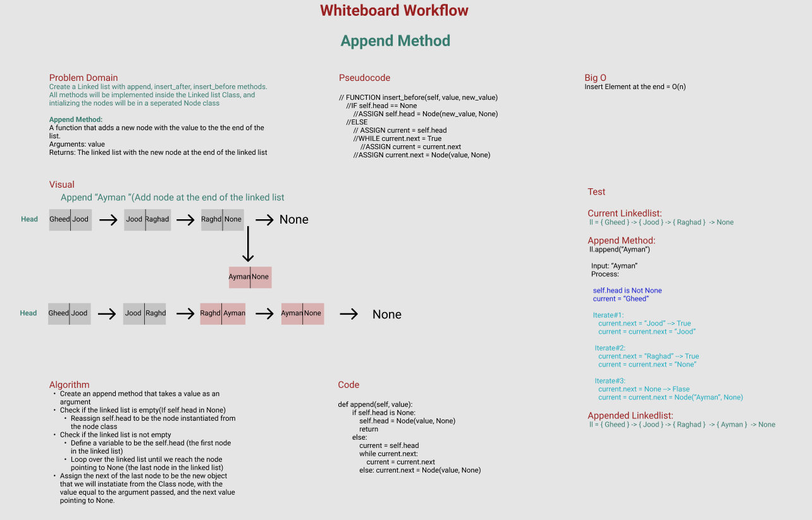
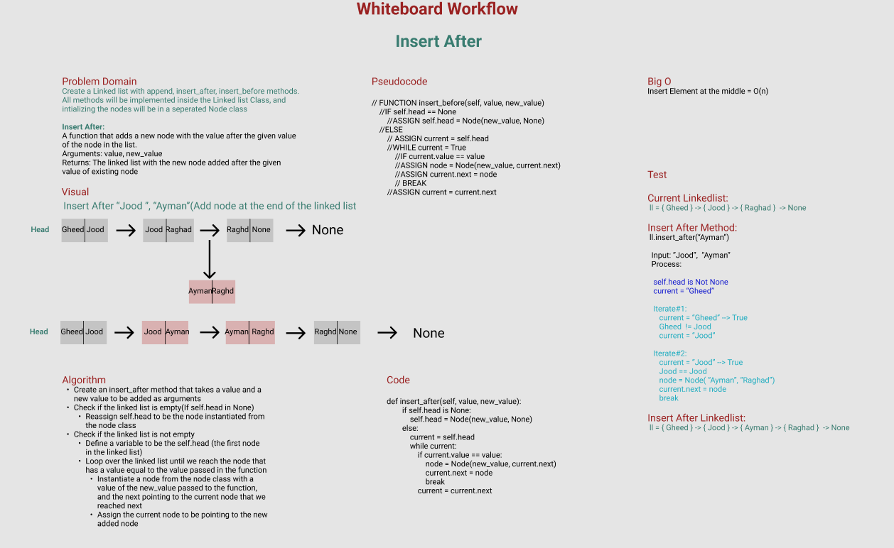
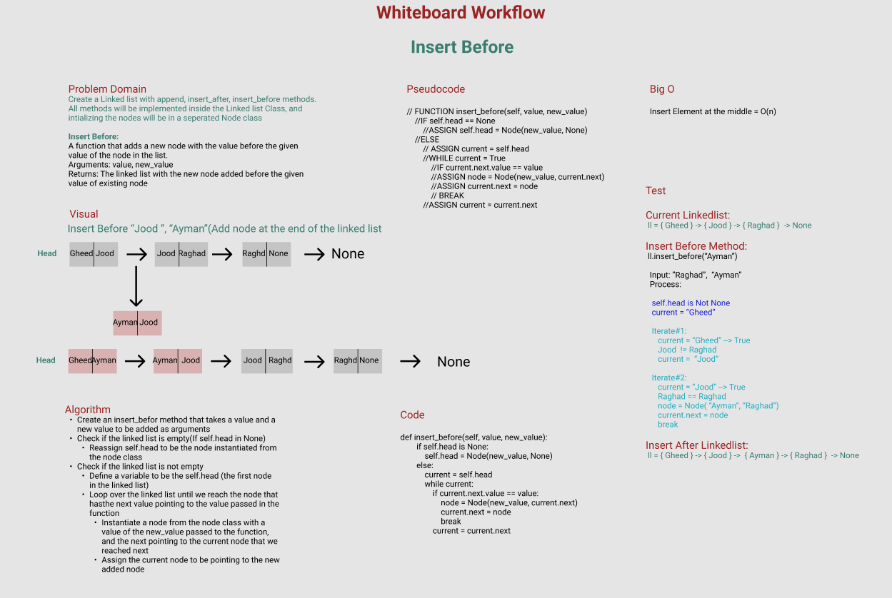

# Challenge Summary
Create a Linked list with append, insert_after, insert_before methods.
All methods will be implemented inside the Linked list Class, and intializing the nodes will be in a seperated Node class.

**Four Methods will be added:**

**Append Method:**
A function that adds a new node with the value to the the end of the list.
Arguments: value
Returns: The linked list with the new node at the end of the linked list

**Insert After:**
A function that adds a new node with the value after the given value of the node in the list.
Arguments: value, new_value
Returns: The linked list with the new node added after the given value of existing node

**Insert Before:**
A function that adds a new node with the value before the given value of the node in the list.
Arguments: value, new_value
Returns: The linked list with the new node added before the given value of existing node

**Remove Node:**
A function that removes node with a specific index(first, second, third node) from the list
Input: index of the node
Output: L.L with the node removed

## Whiteboard Process
<!-- Embedded whiteboard image -->
**Append Method:**

**Insert After Method:**

**Insert Before Method:**

## Approach & Efficiency

**Append Node:**
1. Create an append method that takes a value as an argument
2. Check if the linked list is empty(If self.head in None)
3. Reassign self.head to be the node instantiated from the node class
4. Check if the linked list is not empty
5. Define a variable to be the self.head (the first node in the linked list)
6. Loop over the linked list until we reach the node pointing to None (the last node in the linked list)
7. Assign the next of the last node to be the new object that we will instatiate from the Class node, with the value equal to the argument passed, and the next value pointing to None.

**Insert After:**
1. Create an insert_after method that takes a value and a new value to be added as arguments
2. Check if the linked list is empty(If self.head in None)
3. Reassign self.head to be the node instantiated from the node class
4. Check if the linked list is not empty
5. Define a variable to be the self.head (the first node in the linked list)
6. Loop over the linked list until we reach the node that has a value equal to the value passed in the function
7. Instantiate a node from the node class with a value of the new_value passed to the function, and the next pointing to the current node that we reached next
8. Assign the current node to be pointing to the new added node

**Insert Before:**
1. Create an insert_before method that takes a value and a new value to be added as arguments
2. Check if the linked list is empty(If self.head in None)
3. Reassign self.head to be the node instantiated from the node class
4. Check if the linked list is not empty
5. Define a variable to be the self.head (the first node in the linked list)
6. Loop over the linked list until we reach the node that has the next value pointing to the value passed in the function
7. Instantiate a node from the node class with a value of the new_value passed to the function, and the next pointing to the current node that we reached next
8. Assign the current node to be pointing to the new added node

**Big O:**
- Insert/Delete Element at the end = O(n)
- Insert Element at the middle = O(n)

## Solution

