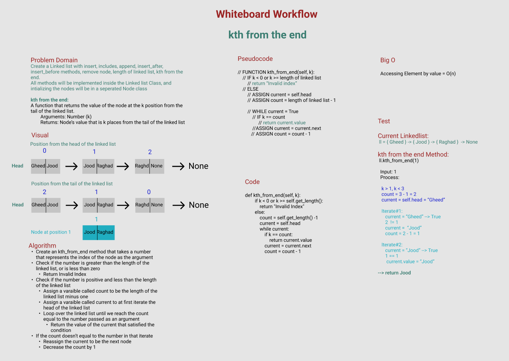

# Challenge Summary

Create a Linked list with insert, includes, append, insert_after, insert_before methods, remove node, length of linked list, kth from the end.
All methods will be implemented inside the Linked list Class, and intializing the nodes will be in a seperated Node class

**kth from the end Method:**
A function that returns the value of the node at the k position from the tail of the linked list.
        Arguments: Number (k)
        Returns: Node’s value that is k places from the tail of the linked list

## Whiteboard Process

## Approach & Efficiency

1. Create an kth_from_end method that takes a number that represents the index of the node as the argument
2. Check if the number is greater than the length of the linked list, or is less than zero
3. Return Invalid Index
4. Check if the number is positive and less than the length of the linked list
5. Assign a varaible called count to be the length of the linked list minus one
6. Assign a varaible called current to at first iterate the head of the linked list
7. Loop over the linked list until we reach the count equal to the number passed as an argument
8. Return the value of the current that satisfied the condition
9. If the count doesn’t equal to the number in that iterate
10. Reassign the current to be the next node 
11. Decrease the count by 1 

**Big O:**

Accessing Element by value = O(n)

## Solution

