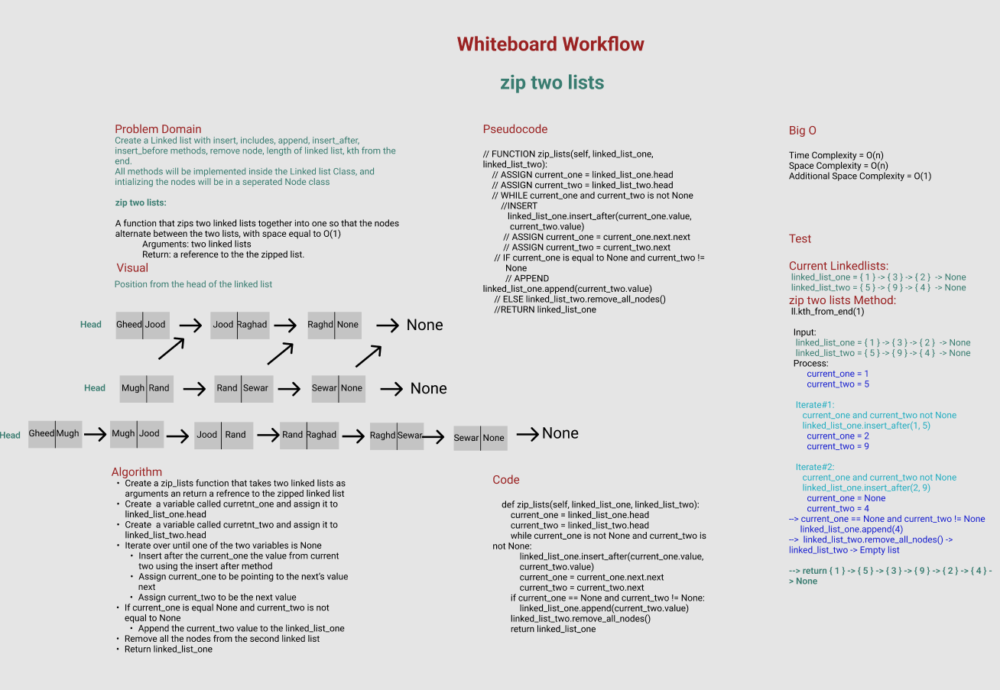

# Challenge Summary
Create a Linked list with insert, includes, append, insert_after, insert_before methods, remove node, length of linked list, kth from the end, zip two lists.
All methods will be implemented inside the Linked list Class, and intializing the nodes will be in a seperated Node class

## Whiteboard Process

## Approach & Efficiency
1. Create a zip_lists function that takes two linked lists as arguments an return a refrence to the zipped linked list
2. Create  a variable called curretnt_one and assign it to linked_list_one.head
3. Create  a variable called curretnt_two and assign it to linked_list_two.head
4. Iterate over until one of the two variables is None
5. Insert after the current_one the value from current two using the insert after method
6. Assign current_one to be pointing to the next’s value next
7. Assign current_two to be the next value
8. If current_one is equal None and current_two is not equal to None
9. Append the current_two value to the linked_list_one
10. Remove all the nodes from the second linked list
11. Return linked_list_one

 **Big O**
Time Complexity = O(n)

Space Complexity = O(n)

Additional Space Complexity = O(1)

## Solution

