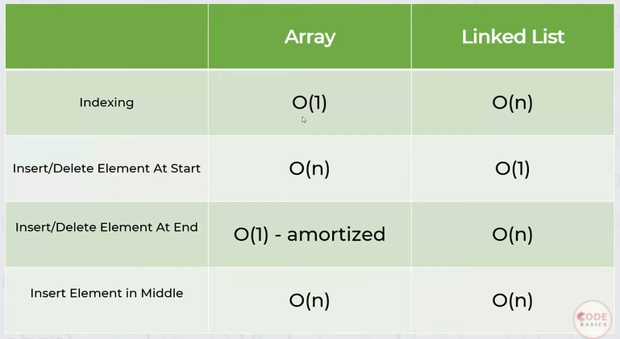

# Linked Lists

Benfits:
1. No need to preallocate space
2. Insertion is easier

**Big O notation:**
Insert/Delete Element at the beginning = O(1)
Insert/Delete Element at the end = O(n)
Insert Element at the middle = O(n)

Linked list Traversal = O(n)
Accessing Element by value = O(n)

Array vs Link list:

