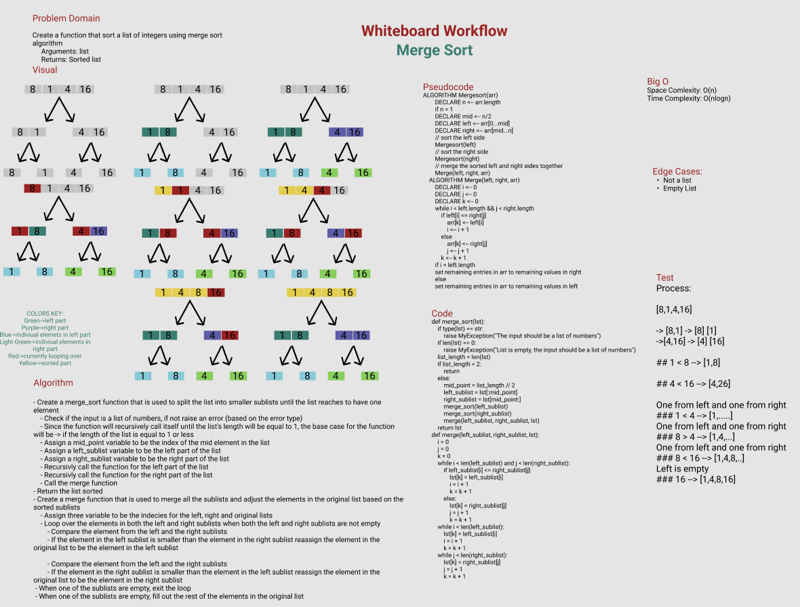

# Merge Sort
- Merge sort works by splitting the input list into two halves, repeating the process on those halves, and finally merging the two sorted halves together. The algorithm first moves from top to bottom, dividing the list into smaller and smaller parts until only the separate elements remain.
- The merge sort algorithm adopts the divide-and-conquer algorithm paradigm to sort elements within a list efficiently.

## What Are Divide And Conquer Algorithms?
- The initial problem is divided into associated subproblems where a solution can be applied recursively to each subproblem. The final solution to the larger problem is a combination of the solutions to the subproblems.

**There are three main components of the divide-and-conquer approach to algorithm design:**
1. Divide: continuously break down the larger problem into smaller parts.
2. Conquer: solve each of the smaller parts by utilising a function that’s called recursively.
3. Combine: merge all solutions for all smaller parts into a single unified solution, which becomes the solution to the starting problem.

## How Merge Sort Works
Merge sort operation follows the basis of dividing the list into halves and continuously dividing the new halves down to their individual component. Then there is a comparison between individual components, which are merged to form the final sorted list.

## Merge Sort Performance
*Time complexity:* O(n * log(n))

Each broken down subpart of the initial list that’s sorted using the merge sort algorithm takes linear time to merge with another subpart.

*Space Complexity: *O(n)

Merge sort has space complexity of O(n) because to sort the unsorted list, the recursive function will be splitting and creating subarrays but the sum of sizes of all the subarray will be n.

## Algorithm
- Create a merge_sort function that is used to split the list into smaller sublists until the list reaches to have one element
    - Check if the input is a list of numbers, if not raise an error (based on the error type)
    - Since the function will recursively call itself until the list's length will be equal to 1, the base case for the function will be -> if the length of the list is equal to 1 or less
    - Assign a mid_point variable to be the index of the mid element in the list
    - Assign a left_sublist variable to be the left part of the list
    - Assign a right_sublist variable to be the right part of the list
    - Recursivly call the function for the left part of the list
    - Recursivly call the function for the right part of the list
    - Call the merge function 
- Return the list sorted
- Create a merge function that is used to merge all the sublists and adjust the elements in the original list based on the sorted sublists
    - Assign three variable to be the indecies for the left, right and original lists
    - Loop over the elements in both the left and right sublists when both the left and right sublists are not empty
        - Compare the element from the left and the right sublists
        - If the element in the left sublist is smaller than the element in the right sublist reassign the element in the original list to be the element in the left sublist

        - Compare the element from the left and the right sublists
        - If the element in the right sublist is smaller than the element in the left sublist reassign the element in the original list to be the element in the right sublist
        - When one of the sublists are empty, exit the loop
    - When one of the sublists are empty, fill out the rest of the elements in the original list
## Pseudo Code
    ALGORITHM Mergesort(arr)
        DECLARE n <-- arr.length

        if n > 1
        DECLARE mid <-- n/2
        DECLARE left <-- arr[0...mid]
        DECLARE right <-- arr[mid...n]
        // sort the left side
        Mergesort(left)
        // sort the right side
        Mergesort(right)
        // merge the sorted left and right sides together
        Merge(left, right, arr)

    ALGORITHM Merge(left, right, arr)
        DECLARE i <-- 0
        DECLARE j <-- 0
        DECLARE k <-- 0

        while i < left.length && j < right.length
            if left[i] <= right[j]
                arr[k] <-- left[i]
                i <-- i + 1
            else
                arr[k] <-- right[j]
                j <-- j + 1

            k <-- k + 1

        if i = left.length
        set remaining entries in arr to remaining values in right
        else
        set remaining entries in arr to remaining values in left

## Python Implementation
```python
def merge_sort(lst):
    if type(lst) == str:
        raise MyException("The input should be a list of numbers")
    if len(lst) == 0:
        raise MyException("List is empty, the input should be a list of numbers")
    list_length = len(lst)
    # Base Case
    if list_length < 2:
        return
    else:
        mid_point = list_length // 2
        left_sublist = lst[:mid_point]
        # print(left_sublist)
        right_sublist = lst[mid_point:]
        # print(right_sublist)

        # Recursive call to divide the left subpart of the list to reach 1 element
        merge_sort(left_sublist)
        # Recursive call to divide the right subpart of the list to reach 1 element
        merge_sort(right_sublist)
        merge(left_sublist, right_sublist, lst)
    return lst

def merge(left_sublist, right_sublist, lst):
    i = 0
    j = 0
    k = 0
    while i < len(left_sublist) and j < len(right_sublist):
        if left_sublist[i] <= right_sublist[j]:
            lst[k] = left_sublist[i]
            i = i + 1
            k = k + 1
        else:
            lst[k] = right_sublist[j]
            j = j + 1
            k = k + 1
    while i < len(left_sublist):
        lst[k] = left_sublist[i]
        i = i + 1
        k = k + 1
    while j < len(right_sublist):
        lst[k] = right_sublist[j]
        j = j + 1
        k = k + 1
```
## Visualization

    [1,4,8,16]

**Step1:**

Divide the list in to two subparts

    [8,1,4,16] -> [8,8] [4,16]

**Step2:**

Divide the two subparts until the lists will contain one element

    [8,1] -> [8] [1]
    [4,16] -> [4] [16]

**Step3:**

Start merging from bottom to top, left to right

Starting by the left part 

    [8] [1]

8 is larger than 1 -> in list at the level above the [8] and [1] reassign 8 to be 1 and 1 to be 8

    [1,8]

**Step4:**

Start merging from bottom to top, left to right

Moving to the right part 

    [4] [16]

16 is larger than 4 -> in list at the level above the 4 will be reassigned to 4 and 16 to 16

    [4,16]

**Step5:**

Moving to the level that we merged the lists with single elemnts in

    [1,8] [4,16]

Start merging the two sublists and reassiging the elements in the top-level list

Start by comparing the element from the left with the element from the right

1 < 4 -> Assign the first element in the orignal list to be 1

    [1, .....]

**Step6:**

Next compare the second element in the left sublist with the first element in the right sublist

8 > 4 -> Assign the second element in the original list to be 4

    [1,4 .....]

**Step7**

Next compare the second element in the left sublist with the second element in the right sublist

8 < 16 -> Assign the third element in the original list to be 8

    [1,4,8 .....]

**Step8**

Since the left sublist is now empty, assign the last element in the right sublist to be the forth element in the original list

    [1,4,8,16]

## Whiteboard Process

