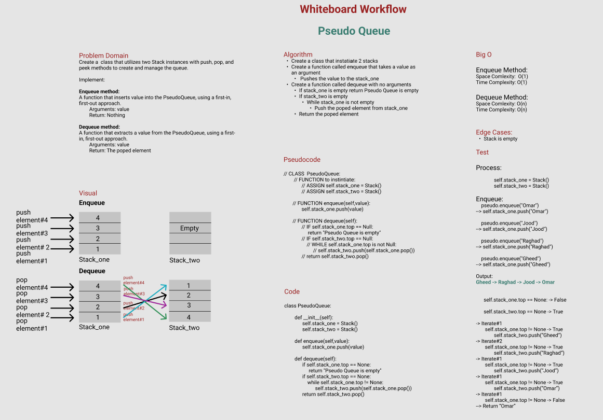

# Challenge Summary
Create a  class that utilizes two Stack instances with push, pop, and peek methods to create and manage the queue.

**Implement:**

**Enqueue method:**

A function that inserts value into the PseudoQueue, using a first-in, first-out approach.
        Arguments: value
        Return: Nothing

**Dequeue method:**

A function that extracts a value from the PseudoQueue, using a first-in, first-out approach.
        Arguments: value
        Return: The poped element

## Whiteboard Process

## Approach & Efficiency
1. Create a class that instatiate 2 stacks

2. Create a function called enqueue that takes a value as an argument

    3. Pushes the value to the stack_one

4. Create a function called dequeue with no arguments

    5. If stack_one is empty return Pseudo Queue is empty

    6. If stack_two is empty

        7. While stack_one is not empty

            8. Push the poped element from stack_one 

    9. Return the poped element

**Big O:**

*Enqueue Method:*
- Space Comlexity:  O(1)
- Time Complexity: O(1)

*Dequeue Method:*
- Space Comlexity: O(n)
- Time Complexity: O(n)

## Solution

