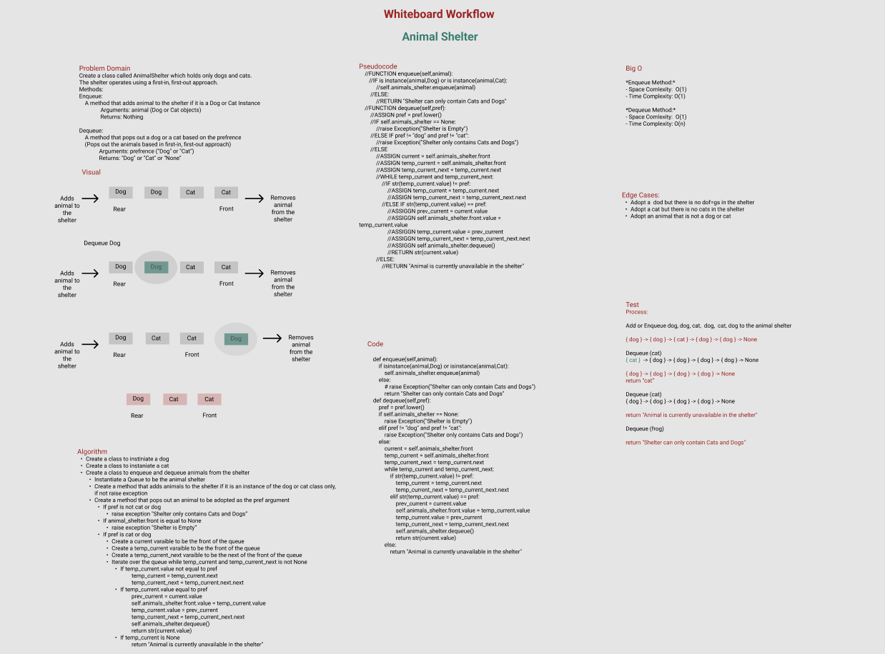
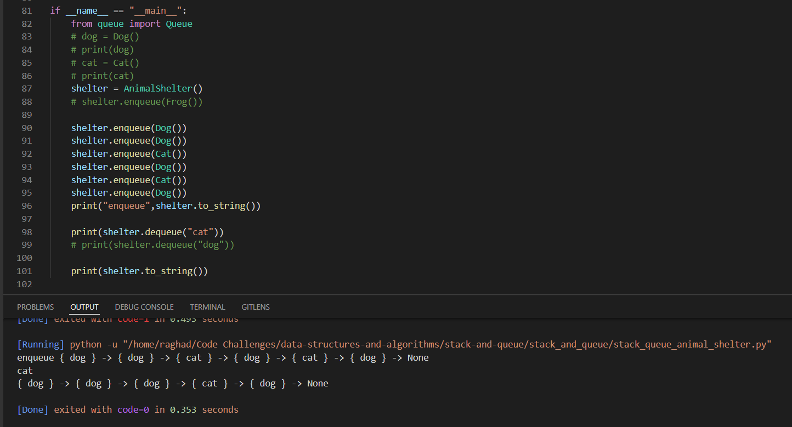

# Challenge Summary
Create a class called AnimalShelter which holds only dogs and cats.
The shelter operates using a first-in, first-out approach.

**Methods:**

*Enqueue:*

    A method that adds animal to the shelter if it is a Dog or Cat Instance
    Arguments: animal (Dog or Cat objects)
    Returns: Nothing

*Dequeue:*

    A method that pops out a dog or a cat based on the prefrence
    (Pops out the animals based in first-in, first-out approach)
    Arguments: prefrence ("Dog" or "Cat")
    Returns: "Dog" or "Cat" or "None"

## Whiteboard Process

## Approach & Efficiency
**Approach:**

- Create a class to instiniate a dog
- Create a class to instaniate a cat
- Create a class to enqueue and dequeue animals from the shelter
- Instantiate a Queue to be the animal shelter
- Create a method that adds animals to the shelter if it is an instance of the dog or cat class only, if not raise exception 
- Create a method that pops out an animal to be adopted as the pref argument
- If pref is not cat or dog 
    raise exception "Shelter only contains Cats and Dogs”
- If animal_shelter.front is equal to None
    raise exception "Shelter is Empty”
- If pref is cat or dog
    - Create a current varaible to be the front of the queue
    - Create a temp_current varaible to be the front of the queue
    - Create a temp_current_next varaible to be the next of the front of the queue
    - Iterate over the queue while temp_current and temp_current_next is not None
        - If temp_current.value not equal to pref
            temp_current = temp_current.next
            temp_current_next = temp_current.next.next
        - If temp_current.value equal to pref
            prev_current = current.value
            self.animals_shelter.front.value = temp_current.value
            temp_current.value = prev_current
            temp_current_next = temp_current_next.next
            self.animals_shelter.dequeue()
            return str(current.value) 
        - If temp_current is None
            return "Animal is currently unavailable in the shelter"

**Big O**

*Enqueue Method:*
- Space Comlexity:  O(1)
- Time Complexity: O(1)

*Dequeue Method:*
- Space Comlexity:  O(1)
- Time Complexity: O(n)

## Solution
