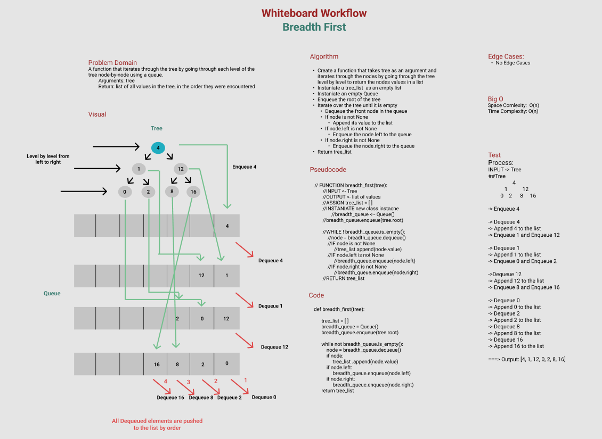

# Challenge Summary
A function that iterates through the tree by going through each level of the tree node-by-node using a queue.

    Arguments: tree
    Return: list of all values in the tree, in the order they were encountered

## Whiteboard Process

## Approach & Efficiency
**Appraoch**

- Create a function that takes tree as an argument and iterates through the nodes by going through the tree level by level to return the nodes values in a list

- Instaniate a tree_list  as an empty list

- Instaniate an empty Queue

- Enqueue the root of the tree

- Iterate over the tree unitl it is empty

    - Dequeue the front node in the queue

    - If node is not None

        - Append its value to the list

    - If node.left is not None

        - Enqueue the node.left to the queue

    - If node.right is not None

        - Enqueue the node.right to the queue

- Return tree_list

**Big O**

Space Comlexity:  O(n)

Time Complexity: O(n)

## Solution
