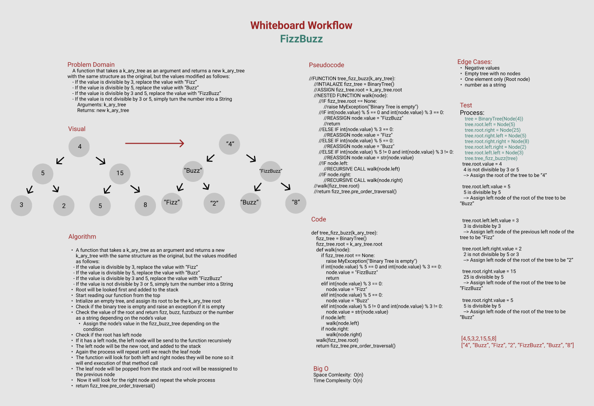

# Challenge Summary
A function that takes a k_ary_tree as an argument and returns a new k_ary_tree with the same structure as the original, but the values modified as follows:

- If the value is divisible by 3, replace the value with “Fizz”
- If the value is divisible by 5, replace the value with “Buzz”
- If the value is divisible by 3 and 5, replace the value with “FizzBuzz”
- If the value is not divisible by 3 or 5, simply turn the number into a String

    Arguments: k_ary_tree
    Returns: new k_ary_tree

## Whiteboard Process

## Approach & Efficiency
**Approach:**
- A function that takes a k_ary_tree as an argument and returns a new k_ary_tree with the same structure as the original, but the values modified as follows:
    - If the value is divisible by 3, replace the value with “Fizz”

    - If the value is divisible by 5, replace the value with “Buzz”

    - If the value is divisible by 3 and 5, replace the value with “FizzBuzz”

    - If the value is not divisible by 3 or 5, simply turn the number into a String

- Root will be looked first and added to the stack
- Start reading our function from the top
- Intialize an empty tree, and assign its root to be the k_ary_tree root
- Check if the binary tree is empty and raise an exception if it is empty
- Check the value of the root and return fizz, buzz, fuzzbuzz or the number as a string depending on the node’s value
- Assign the node’s value in the fizz_buzz_tree depending on the condition
- Check if the root has left node
- If it has a left node, the left node will be send to the function recursively
- The left node will be the new root, and added to the stack
- Again the process will repeat until we reach the leaf node
- The function will look for both left and right nodes they will be none so it will end execution of that method call
- The leaf node will be popped from the stack and root will be reassigned to the previous node
- Now it will look for the right node and repeat the whole process
- return fizz_tree.pre_order_traversal()

**Big O**

Space Comlexity:  O(n)

Time Complexity: O(n)
## Solution
